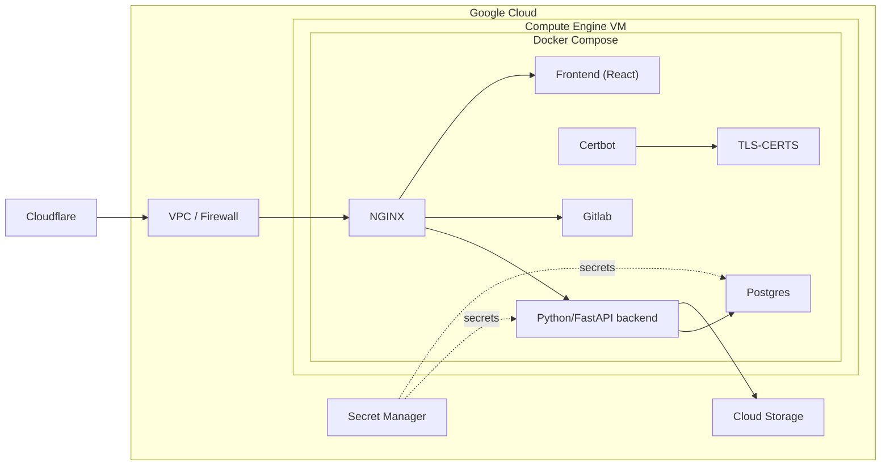

This repo houses a basic python program intended to be run as a container. Docker-compose file is already included. The goal of this is to demonstrate a basic working CRUD app using Python and to include testing.

The stack currently is fastapi, pyodbc, postgres, and react.
## Architecture diagram

## Dependencies
### Python
- fastapi
- uvicorn
- pydantic
- pyodbc
- bcrypt
- passlib
- user_agents
- httpx
- pytest
- packaging
- google-cloud-secret-manager

## Installation
- You will need to git clone the repo into /opt/blog/ and have all the raw files in that directory instead of the subfolder.
- Move blog-start.sh and blog-stop.sh to /usr/local/bin with root owner and 700 permissions
- Move blog.service over to /etc/systemd/system path with root owner and 700 permissions
- Run via terminal sudo podman-compose -f docker-compose.prd.yaml --profile-build run --rm frontend-build to build the static frontend files since this doesn't run an NPM server in prod
- Run via terminal sudo systemctl enable --now blog.service to actually start the rest of the blog services